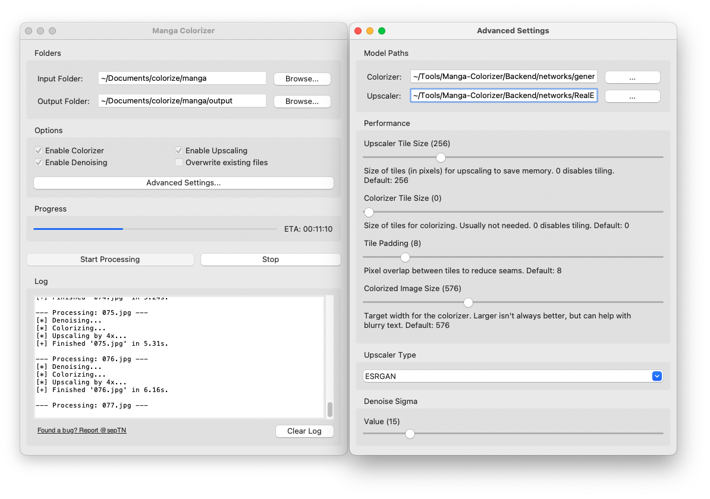
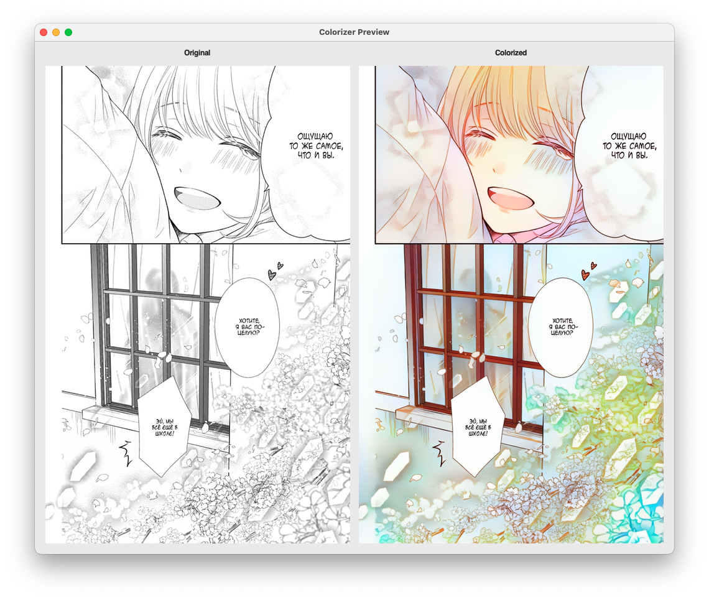

# Manga Colorizer (Standalone GUI Fork of Fork)

This project provides a standalone desktop application with a graphical user interface (GUI) for the [Manga-Colorizer](https://github.com/BinitDOX/Manga-Colorizer). It functions as a UI wrapper, removing the original client/server architecture that required running a backend server and a browser-based front end (like Firefox, Safari, or Chrome).




Unlike the original version which colorized images directly on websites, this application allows you to process local image files from any folder on your computer. This provides a streamlined, offline-first workflow for colorizing, denoising, and upscaling your manga pages, allowing you to process entire folders of images with just a few clicks.

**TL;DR**
- **Original:** Runs a server + uses your web browser as a plugin to process pages.  
- **This fork:** Runs as a desktop app — no browser, no separate server.  
- **Original:** Processes web pages individually.
- ~~**This fork:** Can process entire folders at once.~~
-  **This fork of the fork:** Can process entire directorys with subdirs at once
-  **This fork of the fork:** Has fixed the Colorize hue shift by seperating Colorize input res from input res(for denoise/upscale) then merge them
-  **This fork of the fork:** Uses compact folder-level progress logs by default (for example: `Processing: c101 [13/22] (59%)`)
-  **This fork of the fork:** Keeps per-image step logs available via Advanced Settings -> Logging -> `Enable detailed per-image debug logs`
-  **This fork of the fork:** Adds controlled preview navigation (`Prev`, `Next`, `Random`, `Re-run Current`) with deterministic image index tracking
-  **This fork of the fork:** Adds live preview tuning for denoise sigma and color-transfer quality controls with debounced reruns on the same page
-  **This fork of the fork:** Adds named quality presets with global defaults, per-folder overrides, and JSON import/export
-  **This fork of the fork:** Extracts transfer/mask logic into `Backend/transfer_quality.py` for easier maintenance

### Preview Tuning Workflow

- Open `Preview` from the main window to launch side-by-side original vs colorized rendering.
- Both preview images are now scrollable (horizontal + vertical) so full pages can be inspected without forced thumbnail cropping.
- Scroll position is synchronized between Original and Colorized panes for easier A/B comparison.
- Navigate with `Prev`, `Next`, or `Random`; use `Re-run Current` to force refresh on the same page.
- Use `Zoom` to scale both panels while keeping scroll access for detail inspection.
- Zoom supports typed percentages (for example `130`), `Fit Width`, `Fit Height`, `Ctrl +`, `Ctrl -`, and `Ctrl + mouse wheel`.
- Live tuning is compact and collapsible (`Show Live Tuning`) with hover tooltips for parameter details.
- Debug masks are available in Preview (`Edge`, `Line Ink`, `Screentone`) with `Overlay` and `Mask only` modes so detection regions can be inspected and tuned.
- Use `Actions -> Export current original + masks...` to save a bundle containing source image, working image, previewed colorized image, full-strength raw masks, overlays, and metadata for offline review.
- Preset management in preview is under a single `Actions` dropdown:
  - New preset from current values
  - Save to selected preset
  - Rename/delete preset
  - Set active preset (folder/global)
  - Revert folder to `Default`
  - Import/export presets as JSON

Preset data is stored in `settings.json` under `presets.items`, with `active_global` and `folder_overrides` for scope selection. PR1.7 uses `line_ink_protection` keys (legacy `ink_protection` imports are still accepted).

---

## 📦 Full Installation Guide

Follow these steps to set up and run the application on your local machine.

### 1️⃣ Clone the Repository

Clone this repository with Git:

```bash
git clone https://github.com/sepTN/Manga-Colorizer-GUI
cd Manga-Colorizer-GUI
```

Or download as a ZIP and extract it.

---

### 2️⃣ Set Up the Conda Environment (optional)

We recommend **Conda** to manage dependencies.

**Create a new environment:**
```bash
conda create --name manga-colorizer python=3.9
```

**Activate it:**
```bash
conda activate manga-colorizer
```

---

### 3️⃣ Install Required Libraries

**Standard Packages:**
```bash
pip install Flask Flask_Cors matplotlib numpy opencv_python_headless scikit_image einops
```

**PyTorch Installation:** choose the correct one for your system.

- **Mac (Apple Silicon M1/M2/M4):**
  ```bash
  pip install torch torchvision
  ```
- **Windows/Linux with NVIDIA GPU (CUDA):**
  ```bash
  pip install torch torchvision --index-url https://download.pytorch.org/whl/cu130
  ```
- **Windows/Linux without a dedicated GPU:**
  ```bash
  pip install torch torchvision --index-url https://download.pytorch.org/whl/cpu
  ```

---

### 4️⃣ Download the AI Models

Download and place this `generator.zip` file in `Backend/networks/`.

- **Colorizer Model:**  
  [Generator weights](https://drive.google.com/file/d/1qmxUEKADkEM4iYLp1fpPLLKnfZ6tcF-t/view?usp=sharing) → `generator.zip`

- **Upscaler Models:**
  - ESRGAN (default, already included): `RealESRGAN_x4plus_anime_6B.pt`
  - GigaGAN (optional): I haven’t tested this model myself, so you’re on your own here — in the app’s Advanced Settings, you can set the path to the model file manually.

---

### 5️⃣ Run the Application

From the main project folder:
```bash
python app.py
```

The GUI will appear—start colorizing your manga! 🎨

---

## 🙌 Credits

Built on the work of amazing developers:

- [BinitDOX](https://github.com/BinitDOX) – Original [Manga-Colorizer](https://github.com/BinitDOX/Manga-Colorizer)
- [qweasdd](https://github.com/qweasdd) – [manga-colorization-v2](https://github.com/qweasdd/manga-colorization-v2)
- [xiaogdgenuine](https://github.com/xiaogdgenuine) – [Manga-Colorization-FJ](https://github.com/xiaogdgenuine/Manga-Colorization-FJ)
- [xinntao](https://github.com/xinntao) – [Real-ESRGAN](https://github.com/xinntao/Real-ESRGAN)
- [vatavian](https://github.com/vatavian) – Improved fork with on-the-fly colorization
- [iG8R](https://github.com/iG8R) – Testing and feedback
- Forked and streamlined by [sepTN](https://github.com/sepTN) for a simpler all-in-one experience.
